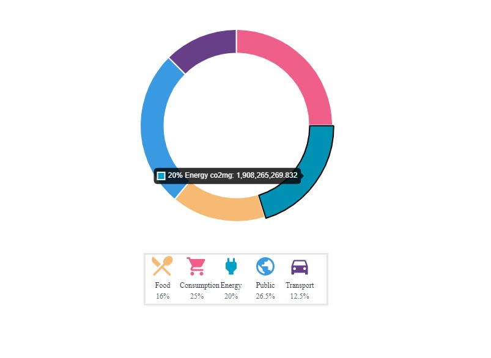

# Ducky - Interview Task

An interactive donut chart displaying environmental data.
**See live:** https://ducky-interview-task.netlify.app/

This project was bootstrapped with [Create React App]

## How It's Made:

**Tech used:** HTML, CSS, JavaScript, React, ChartJS

